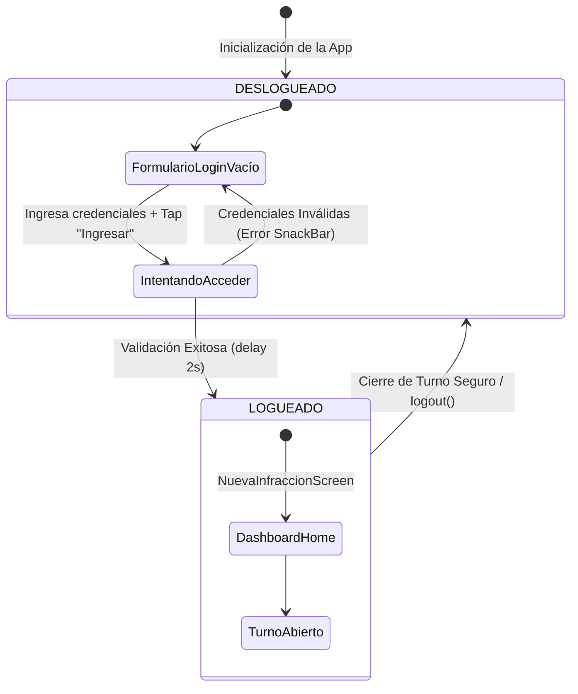
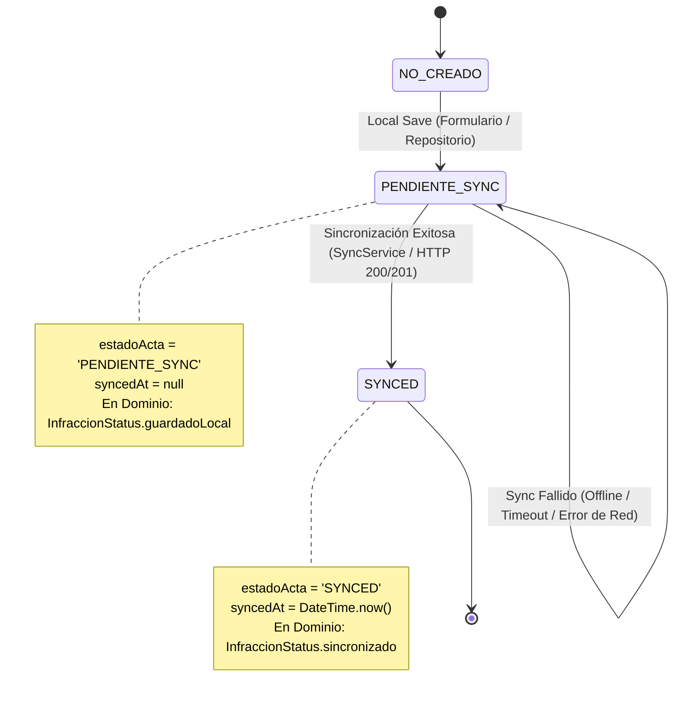

# Diccionario de Datos y Máquinas de Estado - Fiscalis

Este documento detalla el diccionario de datos exacto de las tablas persistidas mediante Drift y la representación formal de las máquinas de estado detectadas en la aplicación.

---

## 1. Diccionario de Datos (Drift Database)

La base de datos SQLite cifrada mediante SQLCipher cuenta con dos tablas desnormalizadas según la normativa DERA, definidas en [database.dart](file:///C:/Sistema_Fiscalizacion_Municipal/sgf_mobile/lib/data/datasources/local/database.dart).

### 1.1. Tabla: `ActasInfraccion`
Almacena la información principal de cada multa o infracción levantada en terreno por el inspector municipal.

*   **Clase Drift**: `ActasInfraccion`
*   **Nombre de Entidad Generada**: `ActasInfraccionData` / `ActasInfraccionCompanion`
*   **Clave Primaria**: `uuid`

| Variable en Dart | Tipo en Drift | Tipo de Dato en Dart | Restricciones / Nulabilidad | Descripción / Observaciones |
| :--- | :--- | :--- | :--- | :--- |
| `uuid` | `TextColumn` | `String` | `NOT NULL` (min: 36, max: 36) | Identificador único universal (UUID v4) de la infracción. |
| `createdAt` | `DateTimeColumn` | `DateTime` | `NOT NULL` (default: `currentDateAndTime`) | Fecha y hora de captura local del acta. |
| `latitud` | `RealColumn` | `double` | `NOT NULL` | Coordenada Y del GPS del dispositivo. |
| `longitud` | `RealColumn` | `double` | `NOT NULL` | Coordenada X del GPS del dispositivo. |
| `direccionFallback` | `TextColumn` | `String?` | `NULLABLE` | Dirección de respaldo si falla el reverse geocoding. |
| `ppu` | `TextColumn` | `String` | `NOT NULL` | Patente Única Nacional del vehículo (Ej: "AAAA12" o "S/P"). |
| `nombreInfractor` | `TextColumn` | `String?` | `NULLABLE` | Nombre completo del infractor (si estuviera presente). |
| `rutInfractor` | `TextColumn` | `String?` | `NULLABLE` | RUT del infractor (si estuviera presente). |
| `tipoVehiculo` | `TextColumn` | `String` | `NOT NULL` | Tipo de vehículo (Ej: "Automóvil", "Camioneta"). |
| `colorVehiculo` | `TextColumn` | `String` | `NOT NULL` | Color del vehículo. |
| `marcaVehiculo` | `TextColumn` | `String` | `NOT NULL` | Marca del vehículo. |
| `tipoInfraccionId` | `IntColumn` | `int` | `NOT NULL` | ID del tipo de infracción según catálogo de ordenanza municipal. |
| `observaciones` | `TextColumn` | `String` | `NOT NULL` | Descripción de los hechos o motivo de la infracción. |
| `inspectorId` | `IntColumn` | `int` | `NOT NULL` | ID del inspector que cursa el acta (fijo a `101` temporalmente). |
| `estadoActa` | `TextColumn` | `String` | `NOT NULL` | Estado del registro. Valores reales en código: `'PENDIENTE_SYNC'`, `'SYNCED'`. *Comentario del código indica: 'BORRADOR', 'PENDIENTE_SYNC', 'SINCRONIZADO'*. |
| `syncedAt` | `DateTimeColumn` | `DateTime?` | `NULLABLE` | Fecha y hora en la que se sincronizó exitosamente con el backend. |
| `deviceId` | `TextColumn` | `String` | `NOT NULL` | Identificador único del dispositivo móvil emisor. |
| `firmaRechazo` | `BoolColumn` | `bool` | `NOT NULL` (default: `false`) | Indica si el infractor se rehusó a firmar/recibir el acta. |

### 1.2. Tabla: `EvidenciasFotograficas`
Almacena las rutas de los archivos de imagen capturados como pruebas físicas y su hash de integridad criptográfico.

*   **Clase Drift**: `EvidenciasFotograficas`
*   **Nombre de Entidad Generada**: `EvidenciasFotograficasData` / `EvidenciasFotograficasCompanion`
*   **Clave Primaria**: `id`

| Variable en Dart | Tipo en Drift | Tipo de Dato en Dart | Restricciones / Nulabilidad | Descripción / Observaciones |
| :--- | :--- | :--- | :--- | :--- |
| `id` | `TextColumn` | `String` | `NOT NULL` (min: 36, max: 36) | Identificador único de la evidencia fotográfica (UUID v4). |
| `actaUuid` | `TextColumn` | `String` | `NOT NULL` (Foreign Key) | UUID del acta asociada. Referencia: `ActasInfraccion(uuid)`. |
| `rutaLocal` | `TextColumn` | `String` | `NOT NULL` | Ruta absoluta física del archivo de imagen en el sandbox del dispositivo. |
| `hashIntegridad` | `TextColumn` | `String` | `NOT NULL` | Hash SHA-256 del archivo físico para verificar integridad. |
| `createdAt` | `DateTimeColumn` | `DateTime` | `NOT NULL` (default: `currentDateAndTime`) | Fecha y hora de captura de la evidencia. |

---

## 2. Máquinas de Estado

A continuación se modelan los flujos de transición de estados de la aplicación.

### 2.1. Máquina de Estado: Autenticación del Inspector

Controlada por el `authProvider` en [auth_provider.dart](file:///C:/Sistema_Fiscalizacion_Municipal/sgf_mobile/lib/presentation/providers/auth_provider.dart).



### 2.2. Máquina de Estado: Formulario de Nueva Infracción (Memoria)

Controlada por el `formularioInfraccionProvider` en [formulario_provider.dart](file:///C:/Sistema_Fiscalizacion_Municipal/sgf_mobile/lib/presentation/providers/formulario_provider.dart).

```mermaid
stateDiagram-v2
    [*] --> INICIAL : Instanciación / Reset Formulario
    
    state INICIAL {
        Note right of INICIAL: latitud == null \n fotosConHash == [] \n isLoading == false
    }

    INICIAL --> CAPTURANDO_GPS : click "Obtener Ubicación GPS"
    
    state CAPTURANDO_GPS {
        Note right of CAPTURANDO_GPS: isLoading == true
    }
    
    CAPTURANDO_GPS --> INICIAL : Captura Fallida (Lanza Excepción)
    CAPTURANDO_GPS --> GPS_CAPTURADO : Captura Exitosa (Coordenadas obtenidas)

    state GPS_CAPTURADO {
        Note right of GPS_CAPTURADO: latitud != null \n longitud != null \n isLoading == false
    }

    INICIAL --> CON_FOTO : click "Tomar Fotografía"
    GPS_CAPTURADO --> VALIDO_PARA_GUARDAR : click "Tomar Fotografía" (fotos.length >= 1)
    CON_FOTO --> VALIDO_PARA_GUARDAR : click "Obtener Ubicación GPS" (Lat/Lng obtenidos)

    state VALIDO_PARA_GUARDAR {
        Note right of VALIDO_PARA_GUARDAR: latitud != null \n fotosConHash.isNotEmpty \n Botón "Guardar" habilitado
    }

    VALIDO_PARA_GUARDAR --> [*] : Guardar Infracción (Drift Transacción y Reset de Estado a INICIAL)
```

### 2.3. Máquina de Estado: Persistencia y Ciclo de Vida del Acta (Base de Datos & Sync)

Representa el estado físico en base de datos local y el backend de sincronización.


